# Emby Live TV Horizontal Cards

> A custom CSS for Emby that changes the vertical TV cards to horizontal. Screenshots below.

---

## Installation

Add this line to the **Admin Dashboard → General → Custom CSS** part in Emby:

```css
@import url('https://cdn.jsdelivr.net/gh/Mub1532/emby-horizontal-livetv-cards-css@main/index.css');
```

---

## About

This was made since emby only allows you to set it horizontal for the main section when you click into it (for example the /list/list.html?type=OnNow page), not other sections or pages, like home page, or tv guide etc so the tv channel thumbnails look weird by default since the thumbnails are landscape but emby css shows it portrait.

---

## Emby Version

Tested on Version 4.10.0.6 beta

---

## Screenshots

### Home Page

| Before | After |
|--------|-------|
| 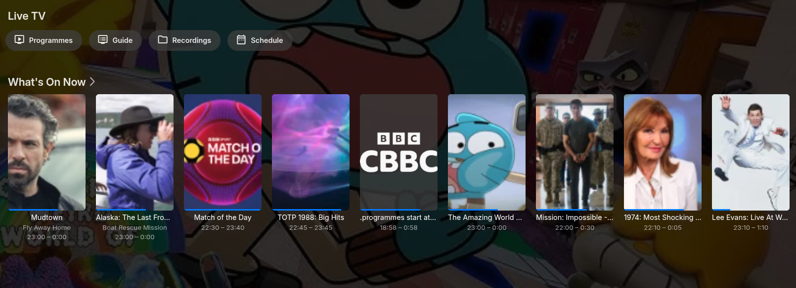 | 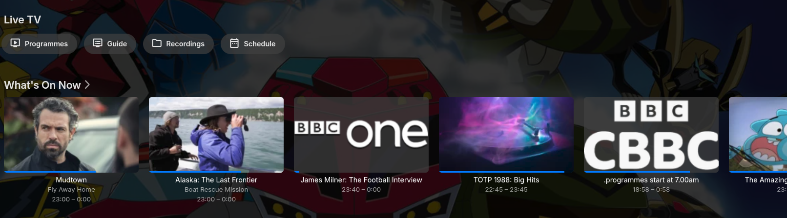 |

---

### Live TV Homepage/Other Lists

| Before | After |
|--------|-------|
| 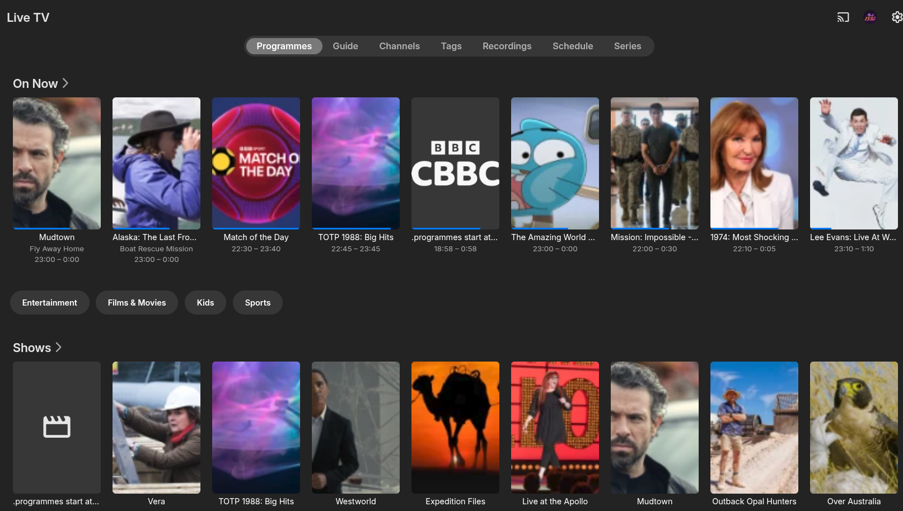 | 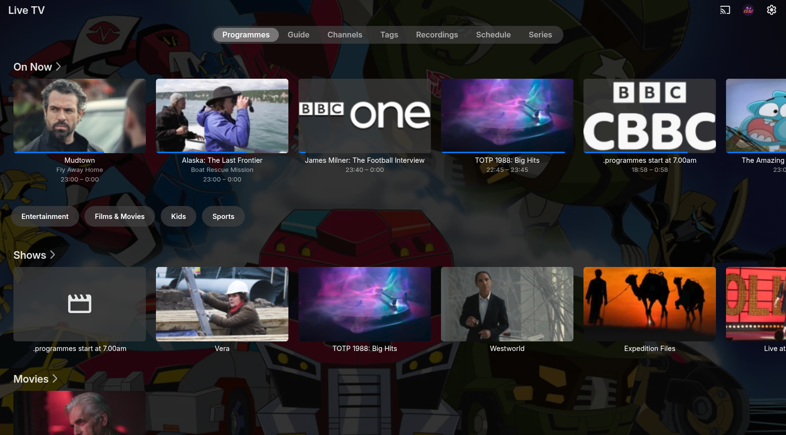 |

---

### Live TV OSD Info

| Before | After |
|--------|-------|
| 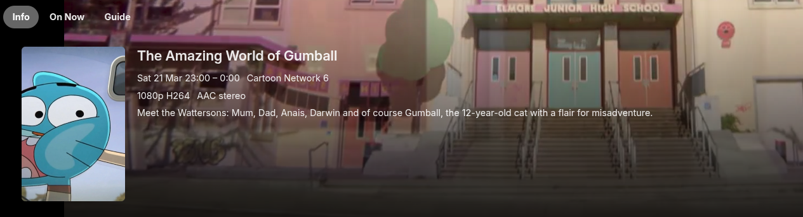 | 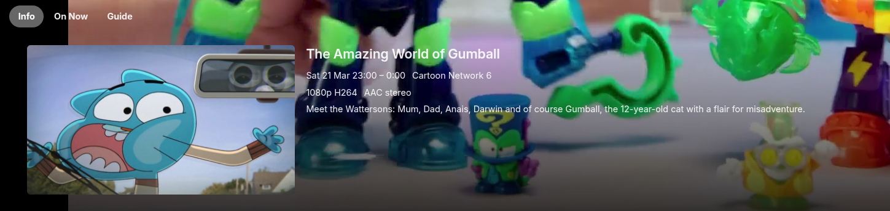 |
| 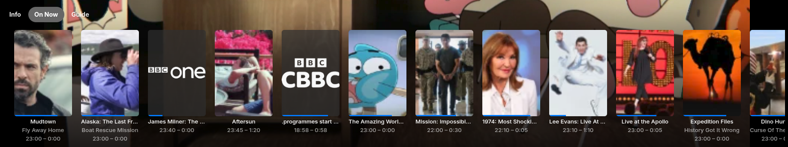 | 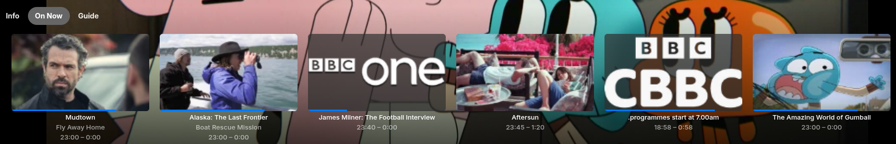 |

---

### TV Guide Item / Individual Item

| Before | After |
|--------|-------|
| 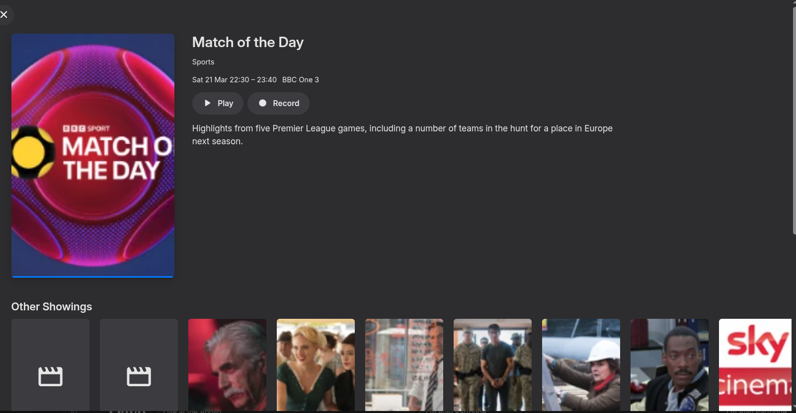 | 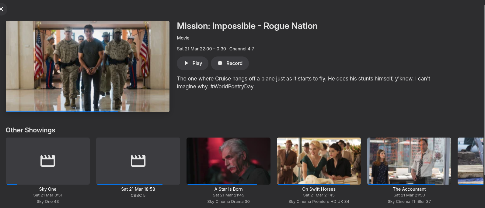 |

---

### TV Guide Channel Schedule Items

| Before | After |
|--------|-------|
| 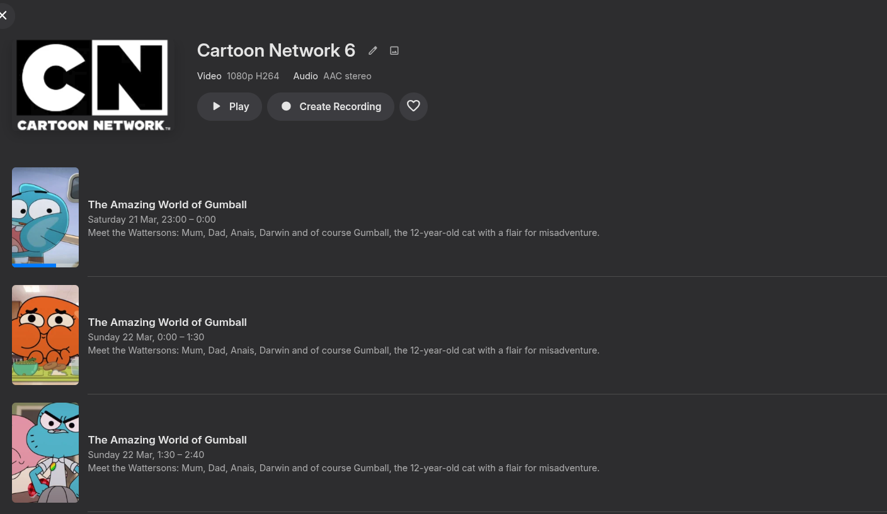 | 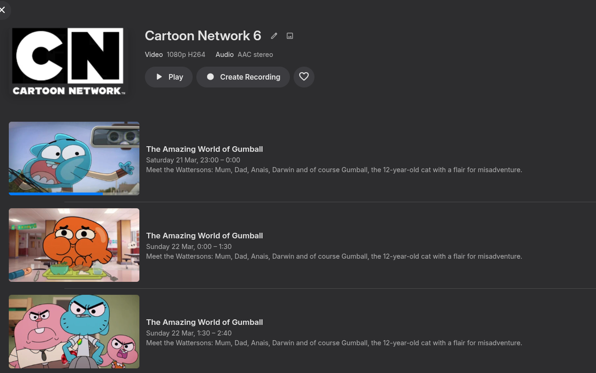 |

---
